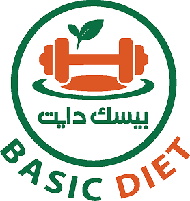

<div align="center">
  

# Basic Diet Operations Dashboard

**Production operations dashboard for managing customers, subscriptions, meal products, orders, payments, fulfilment, staff, and day-to-day Basic Diet administration.**

Built with **React 19.2, TypeScript 5.9, Vite 7, TanStack Query, TanStack Router, TanStack Table, Tailwind CSS 4, React Hook Form, Zod 4, Recharts, Radix UI, and dnd-kit**.
</div>

---

## Table of Contents

- [Overview](#overview)
- [Platform Ecosystem](#platform-ecosystem)
- [Who Uses This Dashboard](#who-uses-this-dashboard)
- [Business Domains](#business-domains)
- [Primary Operational Workflows](#primary-operational-workflows)
- [Technology Stack](#technology-stack)
- [Application Architecture](#application-architecture)
- [Route Organization](#route-organization)
- [State, Forms, and Data Flow](#state-forms-and-data-flow)
- [Authentication and Access](#authentication-and-access)
- [Arabic and RTL Experience](#arabic-and-rtl-experience)
- [Testing and Quality Gates](#testing-and-quality-gates)
- [Local Development](#local-development)
- [Environment Configuration](#environment-configuration)
- [Build and Deployment](#build-and-deployment)
- [Engineering Conventions](#engineering-conventions)
- [Repository Relationship](#repository-relationship)
- [Project Status](#project-status)
- [License](#license)

---

## Overview

This repository contains the internal web dashboard used to operate the **Basic Diet** platform.

Basic Diet is not represented by a single application. The product is split into a customer-facing mobile application, a shared backend API, and an internal operations dashboard. This dashboard is the administrative surface used to manage the business data and workflows that power the customer experience.

The interface covers much more than generic CRUD pages. It coordinates operational work across subscription plans, meal catalogs, customer accounts, one-time orders, payments, fulfilment, pickup branches, promotional tools, staff access, and accounting-oriented views.

The dashboard intentionally keeps security-sensitive business rules on the backend. Its responsibility is to provide a clear and safe operational interface, organize complex workflows, validate user input, and synchronize state with the authoritative backend API.

---

## Platform Ecosystem

| Component | Responsibility | Repository |
| --- | --- | --- |
| **Operations Dashboard** | Internal administration and daily operational workflows | `Basic-Diet/client_dashbourd` |
| **Backend API** | Authentication, persistence, business rules, subscriptions, orders, payments, catalog contracts | [`Basic-Diet/backend`](https://github.com/Basic-Diet/backend) |
| **Mobile App** | Customer onboarding, plans, menu, cart, orders, profile, account flows | [`Basic-Diet/mobile_app`](https://github.com/Basic-Diet/mobile_app) |
| **Engineering Documentation** | Shared workflow and project references | `Basic-Diet/documentations` |

### System relationship

```text
                ┌────────────────────────────┐
                │     Basic Diet Backend     │
                │ Express + MongoDB/Mongoose │
                └──────────────┬─────────────┘
                               │
                  shared business contracts
                               │
              ┌────────────────┴────────────────┐
              │                                 │
   ┌──────────▼──────────┐           ┌──────────▼──────────┐
   │ Operations Dashboard│           │    Mobile App       │
   │ React + Vite         │           │ Flutter + BLoC      │
   └──────────────────────┘           └─────────────────────┘
```

---

## Who Uses This Dashboard

The dashboard is designed for internal operational users rather than public customers. Depending on backend permissions and assigned responsibilities, dashboard users may work with areas such as:

- Customer records
- Subscription operations
- Menu and meal-product management
- Payments and accounting views
- Orders and fulfilment
- Pickup branches
- Dashboard staff accounts
- Promotional configuration
- Premium meals and add-ons
- Manual operational adjustments

Frontend visibility is only one layer of access control. The backend remains responsible for enforcing authorization and business permissions.

---

## Business Domains

### 1. Dashboard & Operational Visibility

- Protected operational workspace
- Dashboard-level summaries and metrics
- Loading, empty, error, and success states
- Responsive data-heavy layouts
- Arabic-first administration experience
- Reusable cards, tables, filters, forms, dialogs, and feedback components

### 2. Customers & Dashboard Users

- Customer/user discovery and management
- Dashboard staff-user administration
- Profile and account workflows
- Search and structured record views
- Permission-aware operational routes

### 3. Packages & Subscriptions

- Diet package administration
- Subscription-plan configuration
- Subscription creation and lifecycle handling
- Freeze and extension workflows
- Cancellation-related actions
- Subscription day modifications
- Manual deduction operations
- Add-on entitlements and subscription-linked options

### 4. Menu, Add-ons & Premium Meals

- Main menu/catalog administration
- Add-on management
- Premium meal management
- Menu identity/configuration workflows
- Reorderable and sortable UI interactions using dnd-kit
- Product data shared with customer-facing ordering experiences

### 5. Orders & Fulfilment

- One-time order administration
- Operational order views
- Delivery-related management
- Pickup-branch configuration
- Fulfilment-oriented workflows
- Notification-related operational interfaces

### 6. Payments & Accounting

- Payment administration
- Accounting-oriented views
- Daily/operational financial data presentation
- Payment-related investigation and record access
- Promotion and promo-code management

---

## Primary Operational Workflows

### Subscription lifecycle

```text
Customer / account selected
        ↓
Plan or subscription configuration
        ↓
Subscription created by backend contract
        ↓
Operational lifecycle actions
  ├─ freeze
  ├─ extend
  ├─ manual deduction
  ├─ fulfilment-related changes
  └─ cancellation-related actions
        ↓
Updated subscription state synchronized to dashboard
```

### Menu management

```text
Dashboard loads authoritative catalog
        ↓
Operator creates or updates products/options
        ↓
Form schema validates input
        ↓
API utility sends request
        ↓
Backend validates business rules
        ↓
TanStack Query invalidates/refetches affected data
```

### Order operations

```text
Order created from customer-side workflow
        ↓
Dashboard loads operational record
        ↓
Staff reviews fulfilment/payment context
        ↓
Allowed backend transition is requested
        ↓
Dashboard reflects authoritative updated status
```

---

## Technology Stack

### Core Application

- **React 19.2**
- **React DOM 19.2**
- **TypeScript 5.9**
- **Vite 7.2**

### Routing & Server State

- **TanStack Router 1.166** — typed route organization and protected route groups
- **TanStack Query 5.90** — server-state fetching, caching, synchronization, mutation workflows
- **TanStack Table 8.21** — structured data-heavy administrative tables

### Forms & Validation

- **React Hook Form 7.71**
- **Zod 4.3**
- **@hookform/resolvers**

### UI & Interaction

- **Tailwind CSS 4.1**
- **Radix UI / shadcn-style primitives**
- **Lucide React**
- **Motion**
- **dnd-kit**
- **Recharts**
- **Sonner**
- **Vaul**
- **React Day Picker**

### Networking & Utilities

- **Axios 1.13**
- **date-fns 4**
- **js-cookie**
- `clsx`, `tailwind-merge`, `class-variance-authority`

### Quality Tooling

- **ESLint 9**
- **Prettier 3**
- **Vitest 4**
- **Testing Library**
- **TypeScript type checking**
- TanStack Query ESLint tooling

The exact installed versions are defined in `package.json` and should be treated as the technical source of truth.

---

## Application Architecture

High-level source structure:

```text
src/
├── components/          # Shared UI + feature-level components
├── constants/           # Reusable configuration and domain constants
├── hooks/               # Custom hooks and reusable feature logic
├── lib/                 # API client, shared libraries, validation/helpers
├── routes/              # TanStack Router route tree
├── types/               # TypeScript contracts
├── utils/               # API/domain utilities and transformations
└── main.tsx              # Vite/React application entry
```

### Architectural responsibilities

#### `components/`
Contains reusable visual building blocks and feature-level UI. Complex business/data logic should not be embedded directly into large presentational components.

#### `hooks/`
Hosts reusable stateful behavior and form/data orchestration where logic is shared or too complex to remain inside a route component.

#### `lib/`
Contains shared application infrastructure such as common helpers, validation utilities, API setup, and library-level configuration.

#### `routes/`
Owns page composition and navigation boundaries. Authenticated operational areas live under an explicit protected route group.

#### `types/`
Defines reusable TypeScript contracts used across routes, components, utilities, and API integrations.

#### `utils/`
Contains feature-oriented API helpers and data transformation logic that should remain independent from the UI layer.

---

## Route Organization

Protected areas are grouped under `_protected` instead of relying on ad-hoc checks in every page.

```text
src/routes/_protected/
├── accounting/
├── addons/
├── dashboard-users/
├── delivery/
├── manual-deduction/
├── menu/
├── notifications/
├── one-time-orders/
├── operations/
├── packages/
├── payments/
├── pickup-branches/
├── premium-meals/
├── profile/
└── promo-codes/
```

This route-level separation provides several benefits:

- Clear ownership of operational domains
- Easier navigation and permission reasoning
- Smaller feature surfaces
- Better separation between admin concerns
- More maintainable code review and testing

---

## State, Forms, and Data Flow

### Server state

Remote API state belongs in **TanStack Query**. The dashboard avoids duplicating backend data into arbitrary global/local state where possible.

Typical flow:

```text
Route / feature component
        ↓
TanStack Query hook
        ↓
Shared API utility / Axios client
        ↓
Basic Diet backend
        ↓
Response normalization
        ↓
Query cache
        ↓
UI
```

### Mutations

For create/update/delete or operational actions:

1. UI gathers input.
2. React Hook Form manages the form lifecycle.
3. Zod validates the expected shape.
4. A mutation calls a shared API utility.
5. Backend business rules execute.
6. Related query keys are invalidated/refetched.
7. Sonner or contextual UI communicates the result.

### Complex forms

Complex form behavior should be separated into:

- Visual form component
- Validation schema
- Reusable form hook when appropriate
- API/data utility
- Domain-specific types/constants

This keeps forms easier to review and prevents operational rules from becoming coupled to layout markup.

---

## Authentication and Access

The dashboard uses a centralized client API layer and protected routing to support authenticated administration.

Frontend responsibilities include:

- Reading the dashboard's persisted authentication/session state
- Attaching authentication information to protected API calls
- Restricting protected route access in the client experience
- Handling invalid/expired authentication responses
- Clearing local session state where required
- Redirecting users away from protected areas when authentication is no longer valid

### Important security boundary

The frontend is **not** the final authorization boundary.

```text
Frontend route protection  → UX/access layer
Backend authorization      → security boundary
```

All sensitive state changes, role checks, and permission decisions must remain enforceable by the backend API.

---

## Arabic and RTL Experience

The operations dashboard is designed primarily for Arabic-speaking operational users.

The implementation includes:

- RTL-oriented layout behavior
- Arabic-first user-facing copy
- Forms and tables designed to remain usable in RTL
- Date/value presentation adapted to operational context
- Responsive layouts for smaller screens
- Shared components intended to preserve RTL behavior consistently

When extending the dashboard, new components should be verified in RTL rather than assuming LTR defaults.

---

## Testing and Quality Gates

The current project scripts include:

```bash
npm run test
npm run test:watch
npm run typecheck
npm run lint
npm run build
npm run preview
```

### What each command protects

| Command | Purpose |
| --- | --- |
| `npm run test` | Executes the Vitest test suite once |
| `npm run test:watch` | Runs tests interactively during development |
| `npm run typecheck` | Validates TypeScript without emitting build files |
| `npm run lint` | Runs ESLint across the project |
| `npm run build` | TypeScript build + optimized Vite production bundle |
| `npm run preview` | Serves the production build locally for verification |

### Recommended release check

```bash
npm run typecheck
npm run lint
npm run test
npm run build
```

A feature should not be considered ready for handoff if it breaks one of these gates.

---

## Local Development

### Prerequisites

- Modern Node.js version compatible with Vite 7 / React 19
- npm or a compatible package manager
- Access to the appropriate Basic Diet backend environment

### Clone and install

```bash
git clone https://github.com/Basic-Diet/client_dashbourd.git
cd client_dashbourd
npm install
```

### Start development

```bash
npm run dev
```

Vite will print the local development URL in the terminal.

---

## Environment Configuration

The frontend requires access to a compatible backend API environment.

The project uses environment-driven API configuration. A typical local value is:

```env
VITE_BACKEND_URL=https://your-api.example.com
```

Environment names and required values should always be verified against the current source before deployment.

### Environment rules

- Never commit production credentials or sensitive tokens.
- Do not hard-code environment-specific API hosts inside feature components.
- Keep environment access centralized.
- Use separate values for local, staging, and production deployments where applicable.

---

## Build and Deployment

### Production build

```bash
npm run build
```

Output is generated by Vite for static web hosting / SPA-compatible deployment infrastructure.

### Local production verification

```bash
npm run preview
```

Before deployment verify:

- Authentication works against the intended backend environment.
- Protected routes cannot be used without a valid session.
- Main operational tables load successfully.
- Forms submit and surface backend validation correctly.
- Arabic/RTL layout remains intact.
- No production secrets are present in client-side environment variables.

---

## Engineering Conventions

When extending this repository:

1. **Keep routes thin.** Route files should compose features rather than absorb every business concern.
2. **Keep server state in TanStack Query.** Avoid duplicating API state into unrelated context/local stores.
3. **Separate forms from schemas.** Validation belongs in reusable schemas, not inline condition chains.
4. **Move complex behavior into hooks/utilities.** UI components should remain readable.
5. **Centralize API calls.** Do not create one-off Axios configuration inside page components.
6. **Respect backend authority.** Do not reimplement security-sensitive business rules only in the browser.
7. **Preserve RTL.** Test new layouts in Arabic/RTL.
8. **Reuse existing UI primitives.** Avoid visually inconsistent one-off controls.
9. **Run quality gates before handoff.** Typecheck, lint, test, and build.
10. **Never commit secrets.** Client-visible environment variables must be treated as public.

---

## Repository Relationship

### Backend

[`Basic-Diet/backend`](https://github.com/Basic-Diet/backend)

The backend owns persistence, authentication, authorization, subscription rules, ordering rules, payment logic, and other authoritative business-state transitions.

### Mobile App

[`Basic-Diet/mobile_app`](https://github.com/Basic-Diet/mobile_app)

The Flutter customer application consumes related backend contracts for onboarding, plans, menu, cart, orders, and account flows.

### Documentation

`Basic-Diet/documentations`

Cross-repository workflow and engineering guidance lives in the documentation repository rather than being duplicated across every application README.

---

## Project Status

This repository represents the delivered Basic Diet operations dashboard and remains available for maintenance, operational improvements, API-contract evolution, and future platform requirements.

The dashboard should be evaluated as one component of the wider Basic Diet ecosystem rather than as an isolated frontend project.

---

## License

This project is proprietary software developed for the Basic Diet platform. All rights reserved unless otherwise stated by the project owners.
